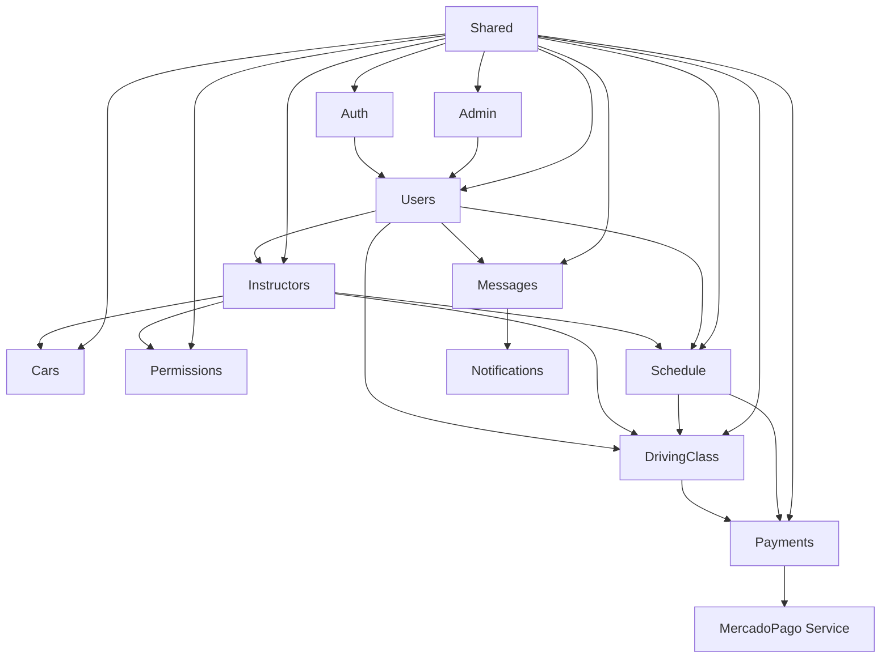

# Arquitectura de ManejApp

## Descripción General

ManejApp es una aplicación de gestión de clases de conducción que permite a estudiantes reservar clases con instructores, manejar pagos y administrar permisos. La aplicación está construida con Node.js, Express, Prisma (PostgreSQL) y utiliza inyección de dependencias para la modularidad.

## Módulos Principales

### 1. Autenticación (Auth)
**Funcionalidades:**
- Login y registro de usuarios con JWT.
- Manejo de sesiones con refresh tokens.
- Validación de roles (STUDENT, INSTRUCTOR, ADMIN).

**Conexiones:**
- Proporciona middleware de autenticación usado por todos los módulos.
- Interactúa con el módulo Users para validar credenciales.
- Las sesiones se almacenan en la base de datos y se validan contra el módulo Users.

### 2. Usuarios (Users)
**Funcionalidades:**
- Gestión de usuarios: registro, consulta, actualización.
- Roles: STUDENT (por defecto), INSTRUCTOR, ADMIN.
- Validación de datos con Zod.

**Conexiones:**
- Base para todos los demás módulos, ya que todos los actores son usuarios.
- El módulo Instructors cambia el rol de STUDENT a INSTRUCTOR al registrar un instructor.
- El módulo Auth usa Users para autenticación.

### 3. Instructores (Instructors)
**Funcionalidades:**
- Registro de instructores (conversión de estudiantes).
- Gestión de perfiles de instructores.
- Asociación con autos y permisos.

**Conexiones:**
- Depende de Users: al registrar un instructor, actualiza el rol del usuario en Users.
- Interactúa con Cars: instructores pueden tener múltiples autos.
- Interactúa con Permissions: asigna permisos automáticamente al registrar.
- Proporciona instructores para el módulo DrivingClass.

### 4. Autos (Cars)
**Funcionalidades:**
- Gestión de autos: marca, modelo, año, placa, transmisión.
- Asociación con instructores.

**Conexiones:**
- Un instructor puede tener múltiples autos.
- Usado por DrivingClass para asignar autos a clases (aunque no implementado directamente).

### 5. Clases de Conducción (DrivingClass)
**Funcionalidades:**
- Creación, listado, actualización y cancelación de clases.
- Asociación entre estudiantes e instructores.
- Estados: scheduled, completed, cancelled.

**Conexiones:**
- Usa Students (subset de Users) y Instructors.
- Genera pagos en el módulo Payments.
- Interactúa con Cars indirectamente a través de instructores.

### 6. Pagos (Payments)
**Funcionalidades:**
- Creación de pagos para clases.
- Integración con MercadoPago para preferencias y webhooks.
- Estados: pending, paid, failed.

**Conexiones:**
- Asociado a DrivingClass: cada clase puede tener pagos.
- Usa MercadoPago service para integraciones externas.
- Notifica cambios de estado vía webhooks.

### 7. Permisos (Permissions)
**Funcionalidades:**
- Definición de permisos obligatorios para instructores.
- Asociación instructor-permiso con estado granted.

**Conexiones:**
- Usado por Instructors: al registrar, se asignan todos los permisos.
- Valida si un instructor tiene todos los permisos para ser válido.

### 8. Administradores (Admin)
**Funcionalidades:**
- (Parcial) Gestión de administradores.
- Asociación 1-1 con usuarios.

**Conexiones:**
- Extiende Users con campos específicos de empresa.

### 9. Horarios (Schedule)
**Funcionalidades:**
- Gestión de slots de disponibilidad de instructores.
- Reserva de turnos por estudiantes.
- Validación de permisos y creación automática de clases.

**Conexiones:**
- Usa Instructors para validar instructores y permisos.
- Crea DrivingClass al reservar un slot.
- Integra con Payments para iniciar pagos.
- Usa Users para roles de estudiante/instructor.

### 10. Mensajería (Messages)
**Funcionalidades:**
- Comunicación directa entre estudiantes e instructores.
- Conversaciones privadas con historial de mensajes.
- Marcado de mensajes como leídos.
- Conteo de mensajes no leídos.

**Conexiones:**
- Asociado a Users: cualquier usuario puede enviar mensajes.
- Usa notificaciones para alertas de nuevos mensajes.
- Integra con el sistema de autenticación.

### 11. Compartido (Shared)
**Funcionalidades:**
- Utilidades: logging, middlewares, validaciones Zod.
- Contenedor de DI para inyección de dependencias.

**Conexiones:**
- Usado por todos los módulos para logging, errores y validaciones.
- El DI container registra servicios de todos los módulos.

## Diagrama de Arquitectura

## Flujo de Comunicación

1. **Registro de Usuario:** Users crea usuario con rol STUDENT.
2. **Autenticación:** Auth valida contra Users, genera tokens.
3. **Registro de Instructor:** Instructors valida que sea STUDENT, crea instructor, actualiza rol en Users, asigna permisos de Permissions y asocia cars.
4. **Creación de Slot:** Schedule valida instructor, crea slots de disponibilidad.
5. **Reserva de Turno:** Schedule valida slot libre, permisos del instructor, crea DrivingClass y inicia pago en Payments.
6. **Creación de Clase:** DrivingClass valida estudiante e instructor, crea clase.
7. **Pago:** Payments crea preferencia en MercadoPago, asocia a clase.
8. **Webhook:** MercadoPago notifica a Payments, actualiza estado.

## Comunicación entre Módulos

- **Inyección de Dependencias:** El contenedor DI inyecta repositorios y servicios entre módulos (e.g., Instructors usa UserRepository).
- **Base de Datos:** Todos los módulos comparten Prisma para acceso a datos, con relaciones definidas en schema.prisma.
- **Middlewares:** Shared proporciona validaciones y logging usados en rutas de todos los módulos.
- **Eventos Externos:** MercadoPago webhooks actualizan Payments, que puede afectar DrivingClass.

## Consideraciones de Diseño

- **Modularidad:** Cada módulo tiene su propio controller, service, routes y repositories.
- **Consistencia:** Uso de Zod para validaciones, CustomizedError para errores, Logger para logs.
- **Seguridad:** JWT para auth, bcrypt para hashes, roles para permisos.
- **Escalabilidad:** DI permite fácil testing y reemplazo de implementaciones.